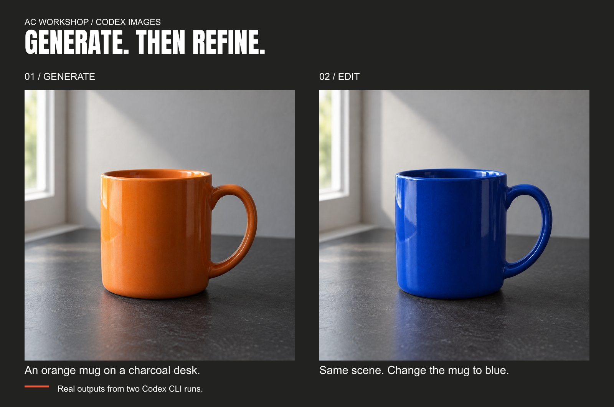
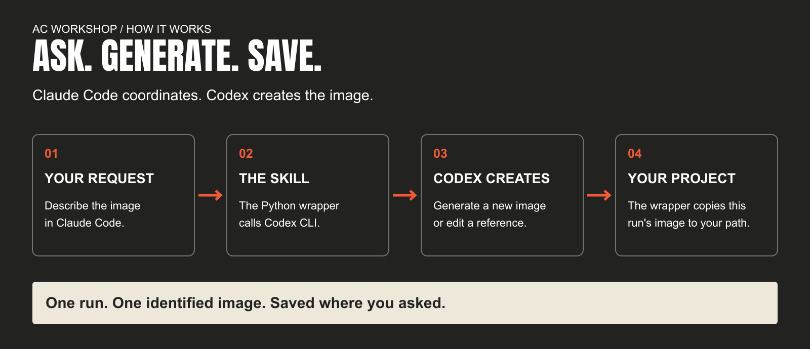

# Codex Images

**Generate and edit images without leaving Claude Code.**

Describe what you want. Claude Code uses Codex CLI to create the image and save it in your project.

## See it work



One prompt created the orange mug. Another changed it to blue. These are real outputs from this skill, not mockups. See the [prompts and verification](examples/README.md). Edits can change unintended details, so review the result.

## Get started

Run this from your project folder:

```bash
npx skills add aaroncrutchfield/ac-workshop --skill codex-images --agent claude-code
```

You'll need Claude Code, Node.js and npm, Python 3.10 or newer, and Codex CLI signed in with access to image generation. Account limits and usage apply.

This installs only `codex-images` for the current project. No other workshop skills are required.

## Make your first image

Ask Claude Code:

> Use codex-images to generate an orange mug on a charcoal desk. Save it to assets/mug.png.

Then try an edit:

> Use codex-images to edit assets/mug.png. Change only the mug to cobalt blue and save it as assets/mug-blue.png.

Claude Code still follows your normal command permissions. This skill does not bypass them.

## How it works



You describe the image. The skill calls Codex CLI, finds the image from that run, and copies it to your chosen location.

It does not overwrite an existing file or automatically retry a generation.

## Tested with

Generation and editing were verified on macOS with Codex CLI **0.153.4**. Automated file-handling checks are configured for Linux and macOS; live generation on Linux and Windows has not been verified. Feature flags and event formats can change between CLI releases.

<details>
<summary>Manual installation</summary>

[Download codex-images.zip](https://github.com/aaroncrutchfield/ac-workshop/releases/download/codex-images-v0.1.1/codex-images.zip), unzip it, and place the entire `codex-images` folder inside your project's `.claude/skills/` directory:

```text
my-project/
  .claude/skills/codex-images/
    SKILL.md
    README.md
    scripts/codex_image.py
    references/prompting.md
    examples/
    LICENSE
```

Keep the supporting files together. You do not need to clone the workshop or install another plugin.

</details>

<details>
<summary>Use it from a terminal</summary>

Run from your project root after installation:

```bash
python3 .claude/skills/codex-images/scripts/codex_image.py \
  --out assets/mug.png \
  -- 'An orange ceramic mug on a charcoal desk. Soft window light from the left. No text or logos.'
```

```bash
python3 .claude/skills/codex-images/scripts/codex_image.py \
  --ref assets/mug.png \
  --out assets/mug-blue.png \
  -- 'Keep the scene and mug shape unchanged. Change only the mug glaze to cobalt blue.'
```

</details>

<details>
<summary>Implementation details</summary>

The wrapper selects the read-only shell sandbox for the child Codex run. It ignores the user's CLI config to avoid inheriting unrelated settings while keeping authentication in place. After the run, Python copies exactly one generated image from the matching thread directory into your chosen output location.

It never scans other runs for a newer image, silently overwrites an output, or automatically retries a generation. The wrapper is a local program with your filesystem permissions; the child's sandbox does not sandbox the wrapper itself.

</details>

<details>
<summary>Troubleshooting</summary>

- **CLI missing or not signed in:** install Codex CLI and run `codex login` first.
- **Image generation unavailable:** check account access and CLI compatibility. Supporting `--enable` alone does not prove image generation is available.
- **No image or multiple images:** the wrapper stops rather than guessing. Review the run before spending usage on another attempt.
- **Output exists:** choose a new filename. There is intentionally no overwrite switch.
- **Wrong extension:** use the extension the error reports; the wrapper does not disguise a JPEG as a PNG.
- **Timeout:** default is 600 seconds; override with `--timeout 900` if needed. Check the prior run before retrying.

</details>

## License

[MIT](LICENSE). The downloadable skill includes a copy. Generated images are demonstration artifacts; no claim of exclusivity is made.
